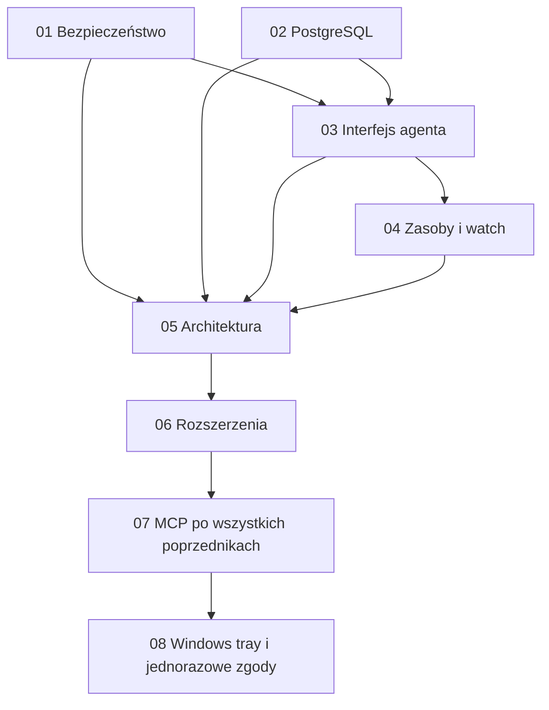

# SQLHarness — plan realizacji audytu 2026-09-26

**Status:** plany zapisane; implementacja nierozpoczęta. Zapis planów nie oznacza wykonania napraw ani zgody na operacje na bazach.

**Źródło:** [pełny audyt i archiwum prób offline](../specs/2026-09-26-project-audit.md), commit `5e655942f4f99f6c84ae47a86ac210c19434b541`.

## Kolejność i zależności

| Plan | Zakres | Zależność |
|---|---|---|
| [01 — Bezpieczeństwo SQL](2026-09-26-audit-01-sql-safety.md) | cele DML, funkcje PG, redakcja, target w Core | pierwszy; szybkie naprawy niezależne od refaktoryzacji |
| [02 — PostgreSQL](2026-09-26-audit-02-postgres-correctness.md) | parametry, TLS, tożsamość, metryki | zadania parametrów i metryk mogą poprzedzać 01; wspólne zmiany AST uzgodnić z 01 |
| [03 — Interfejs dla agentów](2026-09-26-audit-03-agent-interface.md) | JSON, capabilities, validate, budżet odpowiedzi, gain | błędy po redakcji 01; validate po analizie 01/02 |
| [04 — Zasoby i watch](2026-09-26-audit-04-runtime-bounds.md) | deadline, historia, wiadomości, pamięć, niestabilny test | kontrakt prezentacji z 03; deadline niezależny |
| [05 — Architektura](2026-09-26-audit-05-architecture.md) | odpowiedzialności, wspólne mechanizmy, zbędne interfejsy | po naprawach 01/02 i ustaleniu kontraktów 03/04 |
| [06 — Rozszerzenia](2026-09-26-audit-06-extensions.md) | bezpieczna składnia, artefakty, NDJSON, CI, pg_stat_statements | po właściwych fundamentach; część zadań kończy się specyfikacją |
| [07 — MCP](2026-09-26-audit-07-mcp.md) | lokalny adapter stdio nad Core, niezmienny scope, narzędzia i budżety | **po zakończeniu 01–06**, zgodnie z decyzją użytkownika |
| [08 — Windows tray i zgody](2026-09-26-audit-08-windows-approval-tray.md) | lokalny broker jednorazowych zgód na DML wyłącznie naszego MCP | **po 07**; Windows first, Unix w późniejszym osobnym wdrożeniu |

Nie wykonywać planów równocześnie w jednym katalogu: wspólne pliki to `SqlHarnessModule.cs`, `Contracts.cs`, `ISqlDialect.cs`, `Renderer.cs`. Każdy etap powinien kończyć się spójnym, testowalnym stanem. W razie zlecenia implementacji realizować małe zadania i osobne lokalne commity; push nie jest częścią tych planów. Plan 07 ma osobną [specyfikację MCP](../specs/2026-09-26-mcp-adapter-design.md) i nie rozpoczyna się przed zamknięciem poprzedników.



Diagram przedstawia kolejność integracji całych planów. Niezależne zadania, np. naprawa deadline lub liczenia buforów, mogą być wykonane wcześniej zgodnie z tabelą zależności.

## Docelowy podział odpowiedzialności

| Obszar | Obecnie | Po realizacji |
|---|---|---|
| Analiza SQL | classifier dialektu + parser referencji T-SQL + powtórna analiza benchmarku | jedna spójna analiza właściwego silnika, używana przez różne tryby |
| Lifecycle | rozbudowana fasada i runnery odwołujące się do jej helperów | fasada dispatch, przygotowanie operacji, wykonanie rodzin komend, wspólna infrastruktura |
| Odpowiedź | pełny raport/summary lub tekstowy błąd | stabilny wynik i błąd, projekcja z budżetem, szczegóły na żądanie |
| Artefakty | powielone staging/publish/cleanup | osobne writery domenowe nad wspólną publikacją plików |

## Wspólne zasady wykonania

- .NET 8, C#, xUnit; zachować oba silniki: SQL Server i PostgreSQL.
- Jedno wywołanie ma jeden profil i zestaw zmiennych. Nie przełączać celu ani nie ponawiać mutacji automatycznie.
- Trwały DML wymaga dokładnej zgody na batch i bazę oraz obu flag; trwały DDL, dynamiczny SQL i niekontrolowane źródła pozostają niedozwolone.
- Nie wdrażać wyłączenia walidacji jako obejścia błędu parsera.
- Próby parsera wykonywać offline. Testy live tylko na jawnie autoryzowanych jednorazowych bazach; nigdy domyślnie na profilu użytkownika.
- Zachować session setup once, sesję na komórkę matrix, rotację param-set i osobny sidecar wyników PostgreSQL.
- Wartości parametrów, SQL i plany pozostają lokalnie wrażliwe. Budżet prezentacji nie może obcinać danych używanych do equivalence.
- Kody wyjścia 0/2/3/4/5/6/7/8 pozostają zgodne; nowe rozstrzygnięcia domenowe muszą mieć osobny jawny kontrakt.
- Zmiany TLS i maszynowego formatu są ewolucją kontraktu. Nowe plany wskazują docelowy kierunek, ale zapisanie ich nie zmienia obecnego AGENTS.md ani historycznych specyfikacji.

## Pokrycie wszystkich ustaleń

| Ustalenie | Zadanie |
|---|---|
| S1 — OUTPUT INTO | 01/T1 |
| S2 — alias #temp | 01/T1 |
| S3 — efekty funkcji PG i ukryte źródła | 01/T3 |
| S4 — niepełna analiza AST; brak dowodu luki serwerowej | 01/T3 i 02/T1 |
| S5 — TLS | 02/T2 |
| S6 — wyciek błędnych wartości | 01/T2 |
| B1 — parser parametrów PG | 02/T1 |
| B2 — DNS/IP | 02/T2 |
| B3 — bufory, CPU i precyzja czasu | 02/T3 |
| B4 — nadmiarowa blokada składni | 06/T1 |
| B5 — watch deadline i historia | 04/T1–T2 |
| A1 — błędy JSON | 03/T1 |
| A2 — rozmiar summary i komórek | 03/T3, 04/T2–T3 |
| A3 — help, capabilities, rozjazd binarki | 03/T2 |
| A4 — gain i koszt całego zadania | 03/T4 |
| Duplikacja reguł targetu | 01/T4 |
| Szeroki dialekt, fasada, object Report, martwe człony | 05/T1–T2 |
| Duplikacja writerów i mapowania wyjątków | 05/T2–T3 |
| validate offline | 03/T2 |
| Selektywne artefakty | 06/T2 |
| Watch NDJSON | 06/T3 |
| Progi regresji CI | 06/T4 |
| pg_stat_statements | 06/T5 |
| Timeout testu procesu | 04/T4 |
| Dobre istniejące granice i zachowania | ograniczenia wszystkich planów, szczególnie 05 |
| MCP z roadmapy README — dodany na prośbę użytkownika | 07/T1–T7, po zakończeniu 01–06 |
| Tray i zgody na mutacje wyłącznie naszego MCP — dodane na prośbę użytkownika | 08/T1–T8, Windows po 07; T8 tylko przygotowuje późniejszy port |

## Stan dowodów i kryterium zamknięcia

Audyt: 1404 testy przeszły, jeden timeout publikacji PID; powtórzenie tego testu osobno przeszło. NuGet nie zgłosił podatnych zależności w dniu audytu. Nie ma dowodu wykonania exploitów na serwerze. Wyniki nie zastępują weryfikacji przyszłej implementacji.

Każdy plan zawiera zadania z checkboxami, pliki i kryteria. Przy wykonaniu zapisać commit, uruchomione polecenia, faktyczne wyniki oraz niewykonane testy live. Nie zaznaczać zakończenia zadania wymagającego dowodu, którego nie uzyskano. Zadania projektowe 01/T3 i 06/T4–T5 mają jawny rezultat dokumentacyjny przed implementacją zależnych funkcji.

Docelowy przebieg offline po zmianach kodu:

```powershell
dotnet test SqlHarness.sln --filter 'FullyQualifiedName!~Integration' --verbosity minimal
dotnet list SqlHarness.sln package --vulnerable --include-transitive
```

Przy samym zapisie tych dokumentów sprawdzić ścieżki, kompletność mapowania i diff; nie uruchamiać ponownie zestawu testów aplikacji.
