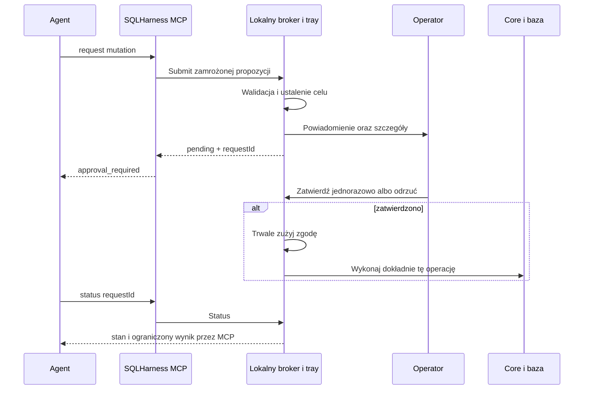

# SQLHarness — Windows tray i jednorazowe zgody na mutacje MCP

**Status:** projekt do realizacji po planie 07 MCP. Zakres potwierdzony przez użytkownika: wyłącznie nasz SQLHarness MCP, najpierw Windows; port uniksowy później.

**Cel:** przed trwałym DML zgłoszonym przez SQLHarness MCP operator otrzymuje powiadomienie i lokalny podgląd dokładnej operacji, po czym zatwierdza ją jednorazowo albo odrzuca. Brak decyzji oznacza brak wykonania.

**Plan:** [08 — Windows approval tray](../plans/2026-09-26-audit-08-windows-approval-tray.md). [Poprzednik MCP](2026-09-26-mcp-adapter-design.md) pozostaje read-only w swojej pierwszej wersji; ten dokument definiuje jego późniejsze, jawnie włączane rozszerzenie.

## 1. Zakres i granica zaufania

- Tylko lokalny SQLHarness MCP i jego operacje INSERT/UPDATE/DELETE/MERGE do trwałych tabel, dopuszczone przez naprawiony Core. SQL Server i PostgreSQL pozostają wspierane.
- Bez ogólnego proxy MCP, podsłuchiwania innych aplikacji, HTTP, usług chmurowych, trwałego DDL, arbitralnych procedur, dynamicznego SQL ani modyfikacji uprawnień bazy.
- Istniejący CLI zachowuje swój kontrakt; plan nie obiecuje blokowania zapisów wykonanych innym programem poza naszym MCP.
- Zagrożenia w zakresie: argumenty wygenerowane przez model, prompt injection w danych, replay, zmiana pliku po podglądzie, współbieżność, pomylenie profilu, timeout i awaria procesu.
- V1 zakłada zaufany lokalny system, zainstalowane binarki oraz operatora. Proces działający jako ten sam użytkownik Windows z możliwością modyfikacji aplikacji, czytania jej pamięci lub automatyzacji UI nie jest skutecznie izolowany przez sam tray/named pipe/DPAPI. Nie przedstawiać tego rozwiązania jako sandboxa dla dowolnego kodu agenta pod tym samym kontem.
- Silniejsza izolacja wymagałaby osobnej tożsamości systemowej i konta DB, niedostępnych dla procesu agenta. To odrębny projekt, nie niejawna instalacja uprzywilejowanej usługi w tym planie. Mechanizm v1 musi jednak uniemożliwiać zatwierdzenie przez API MCP i publiczny IPC.

## 2. Architektura i Windows first

Nowa aplikacja `SqlHarness.Approval.Windows` działa jako proces użytkownika, bez praw administratora i bez usługi Windows. UI: WinForms NotifyIcon, lista żądań i okno szczegółów. Powiadomienia systemowe przez Windows App SDK; wersję zgodną z frameworkiem i modelem dystrybucji przypiąć przy implementacji. V1: Windows 11 x64; inne wersje Windows tylko po osobnej weryfikacji i jawnym rozszerzeniu macierzy.

Broker zgód i maszyna stanów są w platformowo niezależnej bibliotece `SqlHarness.Approvals`. Tray jest composition root brokera, UI, transportu i Core. Serwer MCP korzysta z klienta IPC; nie otrzymuje od brokera write credentials ani capability umożliwiającego lokalne wykonanie zatwierdzonego DML. Broker sam wykonuje przez Core zamrożone żądanie po kliknięciu w lokalnym UI. Uprawnienia kont już skonfigurowanych w MCP nie zmieniają się automatycznie: ograniczenie konta odczytowego i odseparowanie credentials brokera wymagają jawnej konfiguracji operatora. Sam adapter nie odbiera procesowi uprawnień systemowych ani istniejącego dostępu do DB.

Named pipe służy tylko do Submit/Status/Cancel. Nie ma metody Approve, parametru approved=true ani narzędzia MCP podejmującego decyzję. Decyzja operatora pozostaje wewnątrz procesu aplikacji. Połączenie lokalne, ACL użytkownika, odrzucenie klientów sieciowych, weryfikacja peer PID/session i oczekiwanej instalacji. Nie traktować CurrentUserOnly jako potwierdzenia, że rozmówca jest naszym MCP. Wersjonowany handshake i kontrola drugiej strony w obu kierunkach mają wykrywać pomyłkę procesu/pipe; ograniczenia same-user pozostają jawne. MCP utrzymuje połączenie brokera między tools/call; zakończenie pojedynczego request/status nie zamyka sesji powiązania i nie unieważnia oczekującej zgody.

MCP włącza rozszerzenie przez startup `--approval-mode tray` (domyślnie off). Argumenty narzędzi nie mogą zmienić tego ustawienia. Tryb off zachowuje plan 07. Tray można uruchomić ręcznie; autostart tylko z jawnej opcji użytkownika, nigdy jako skutek tools/call. Zamknięta aplikacja oznacza APPROVAL_UNAVAILABLE; MCP nie startuje jej z argumentem udającym zgodę.

## 3. Scope i niezmienność żądania

MCP nadal ma niezmienny profil i vars z planu 07. Broker niezależnie rozwiązuje ten sam profil ze swojej zaufanej konfiguracji, porównuje engine/server/database i wersję polityki z zamrożonym scope MCP. Niezgodność oznacza odmowę przed powiadomieniem. Profil wybiera operator przez konfigurację/start, nie argument mutation tool. Credential binding musi wskazywać ten sam cel; hasło/token nie należy do podglądu ani digestu.

Broker czyta SQL i typowane parametry raz, waliduje je przez Core i przechowuje niezmienny obiekt w pamięci. Wywołanie IPC nie podaje dowolnej ścieżki do odczytu przez broker: kontrolowany reader MCP z 07 materializuje plik, broker otrzymuje treść. Zmiana źródłowego pliku później nie zmienia zatwierdzanej operacji.

Identyfikator i digest wiążą: protokół/wersję kontraktu, broker scope, rozstrzygnięty silnik i cel, dokładny tekst batcha, nazwy/typy/null/value parametrów, timeout, limity wyniku, politykę wykonania i termin ważności. Nie normalizować białych znaków/literalów w sposób zmieniający SQL. Kanonicznie kodować typy i długości. Trwały digest HMAC z kluczem instalacji, aby journal nie ułatwiał zgadywania krótkich wartości parametrów; klucz chroniony lokalnie, nie w MCP response.

Powtórna klasyfikacja po zatwierdzeniu musi użyć tych samych danych i polityki. Po connect wykonać normalną kontrolę tożsamości bazy; mismatch blokuje SQL i zużywa zgodę. Żadnego fallbacku na inną bazę lub konto. Zgoda dotyczy batcha i parametrów, nie zamrożonego zbioru wierszy: dane, triggery i inne obiekty mogą się zmienić. UI nie obiecuje przewidzianej liczby zmienionych wierszy.

## 4. Maszyna stanów, wygaśnięcie i replay

Stany: Pending → Approved → Executing → Succeeded/Failed/OutcomeUnknown. Alternatywne terminalne stany: Denied, Expired, Cancelled, Invalidated. Przejścia atomowe względem requestId; jedna decyzja lokalna, jeden start wykonania.

Pending TTL: 120 s, konfigurowalne przez operatora 30..600 s. Po zatwierdzeniu rozpoczęcie wykonania w ciągu 30 s i przed expiry; zajęty slot oznacza BUSY/Invalidated, bez ukrytej kolejki już zatwierdzonych mutacji. Maksymalnie 20 Pending globalnie i 5 na scope; dalsze żądania odrzucone, powiadomienia grupowane. Jedna aktywna mutacja na broker scope.

Submit przyjmuje `requestKey` UUID do deduplikacji, nie jako zgodę. Ten sam scope+key+digest zwraca istniejący request; zmieniona treść z tym samym key daje REQUEST_CONFLICT. Nowy key zawsze wymaga nowej decyzji operatora. Broker przyznaje nieprzezroczysty requestId, który pozwala tylko sprawdzić/anulować własny scope, nigdy zatwierdzić ani wykonać.

Przed wysłaniem pierwszego modyfikującego polecenia trwale i atomowo zapisać consumed/Executing w journal z flush do dysku. Błąd zapisu blokuje wykonanie. Restart nie odtwarza ani nie wznawia zatwierdzeń. Rekord consumed bez końcowego dowodu staje się OutcomeUnknown, bez ponowienia. Pending/Approved po restarcie → Invalidated. Nie deklarować exactly-once commit; gwarancja aplikacyjna to najwyżej jedna próba wykonania na zgodę.

Journal: wersjonowane rekordy per request, ograniczona retencja 30 dni; requestKey starszy niż retencja nie może dostać cichego automatycznego wykonania — zawsze nowa zgoda. Brak SQL, parametrów, wartości wyników i credentials w journal. Zachować timestamp, scopeId, requestId/key, HMAC digest, stan, decyzję i bezpieczny kod wyniku. Id użytkownika tylko lokalnie zgodnie z polityką prywatności. Nie utożsamiać tego pliku z odpornym na administratora audytem.

Szczegółowy wynik może pozostać ograniczony w pamięci do końca sesji/TTL retencji wyników (domyślnie 10 min). Po restarcie status z journal zachowuje prawdziwy stan i zwraca resultUnavailable zamiast powtarzać SQL w celu odtworzenia odpowiedzi.

## 5. Wykonanie, anulowanie i niepewny wynik

Zgoda uprawnia do pojedynczego batcha DML w istniejącym kontrakcie query. Broker wewnętrznie przekazuje Core AllowMutation=true i dokładny ConfirmDatabase wyłącznie dla zatwierdzonego obiektu; publiczne IPC ani model nie ustawiają tych pól. Persistent DDL/dynamic SQL nadal odrzucone mimo kliknięcia operatora. Nie dopuszczać benchmarków mutacji, matrix ani automatycznego retry.

Nie obiecywać atomowości wielu instrukcji, jeśli Core jej nie zapewnia. W V1 używać istniejącej semantyki query: batch może wykonać częściowe zmiany przed błędem. UI musi pokazywać tę informację przy wieloinstrukcyjnym batchu; wynik błędu po rozpoczęciu SQL może oznaczać zmiany. Nie dodawać niejawnego BEGIN/ROLLBACK zmieniającego semantykę, blokady i pomiary.

Cancel przed wykonaniem uniemożliwia start; podczas wykonania jest żądaniem anulowania, nie gwarancją rollbacku. Utrata połączenia po wysłaniu SQL lub błąd zapisu wyniku po wykonaniu nie może wyglądać jak „nic nie wykonano”. Zwracać OutcomeUnknown/effectsMayHaveOccurred, gdy brak dowodu. Automatic reconnect/retry nie wykonuje mutacji ponownie.

Wyłączenie tray/unpair/restart MCP unieważnia Pending i Approved powiązane z klientem. Dla Executing broker podejmuje best-effort cancellation i zapisuje prawdziwy wynik/niepewność. Utrata samego połączenia IPC nie stanowi dowodu wycofania zmian. Status po ponownym połączeniu jest możliwy tylko przy zweryfikowanym tym samym scope.

## 6. UX Windows

Tray: licznik oczekujących, stan połączenia, Otwórz kolejkę, Wstrzymaj nowe zgody, Historia, Ustawienia, Zakończ. Aplikacja jest pojedynczą instancją w sesji użytkownika. Powiadomienie bez nazwy bazy, SQL, wartości parametrów ani sekretów: „SQLHarness: operacja wymaga decyzji”. Akcje „Przejrzyj” i „Odrzuć”; zatwierdzanie wyłącznie w oknie szczegółów. Toast activation niesie tylko requestId do nawigacji i nie może sama autoryzować wykonania.

Szczegóły: rzeczywisty cel i silnik, rozpoznane tabele/cele OUTPUT, dokładny SQL, typowane parametry (wartości odkrywane lokalnie), timeout, data wygaśnięcia, klasyfikacja, batch wieloinstrukcyjny, stan oraz przyciski „Zatwierdź jednorazowo”/„Odrzuć”. Nazwa klienta i uzasadnienie modelu są niezaufanymi danymi, nie nagłówkiem autorytetu; brak HTML/webview i automatycznych linków. SQL/parametry nie są edytowalne w approval view.

Nie wyświetlać oszacowanej liczby zmienionych wierszy jako pewnej. Pełny batch można przewijać/wyszukiwać; preview nie ukrywa końcowych instrukcji. Rozmiar podglądu ma limit wspólny z wejściem MCP (maks. 16 MiB po materializacji); zbyt duży lub niekompletny podgląd uniemożliwia zatwierdzenie, zamiast akceptować obcięty SQL.

Enter w oknie nie zatwierdza domyślnie; Escape/zamknięcie nie udziela zgody. Przyciski niedostępne po expiry, terminalnym stanie i blokadzie sesji Windows. Powrót ze snu/wznowienie nie przedłuża TTL. Brak trybu „zawsze zezwalaj”, wildcardów, zgód zbiorczych i allowlist SQL. Powiadomienia wyłączone/Do Not Disturb nie obchodzą decyzji: kolejka jest dostępna w tray, TTL nadal działa.

Autostart i powiadomienia konfigurowane lokalnie przez użytkownika; brak automatycznej zmiany jego ustawień Windows. Wszystkie informacje pozostają lokalnie.

## 7. Rozszerzenie kontraktu MCP

W trybie tray dodać jedno narzędzie `sqlharness_mutation` z action request/status/cancel. Request: requestKey, dokładnie jedno źródło SQL, parameters, timeout; status/cancel: wyłącznie requestId. Strict schema i runtime validation wykluczają approved/decision/confirmDatabase/target/force. Domyślne sqlharness_query pozostaje bez trwałych mutacji — brak niespodziewanego promptu po zwykłym query.

Request zwraca szybko pending/approval_required i expiry, nie blokuje tool call na czas decyzji. Status nie ponawia wykonania; polling zalecane nie częściej niż co 2 s, throttle po stronie serwera. Narzędzie nie wyświetla SQL ani wartości parametrów w statusie. Po decyzji broker sam wykonuje operację — model nie otrzymuje tokenu do późniejszego consume.

Plan 07 ma maksymalnie 11 tools; po włączeniu tego rozszerzenia katalog ma najwyżej 12, nadal w budżecie 32 KiB. Wynik nadal ≤16 KiB CallToolResult domyślnie z oboma przedstawieniami JSON. Schema obejmuje pending/denied/expired/busy/unknown/completed. Te stany są maszynowo rozróżnialne, a status poprawnie pobrany nie jest błędem transportu; nie maskować błędu wykonania jako sukcesu.

Capabilities podaje approvalMode i dostępność brokera, bez sekretów i listy innych scope. Read-only działa przy braku tray. Dla tego samego scope wykonywanie DB z MCP i mutacja z brokera muszą używać wspólnego gate: przed Executing broker uzyskuje wyłączny slot; każda kolizja → BUSY, żadnego nakładania benchmarku i mutacji. Pending nie rezerwuje połączenia ani blokady DB.

## 8. Przenośność i wydanie

Biblioteka Approvals zawiera maszynę stanów, identity/digest, journal contract i reguły; Windows projekt zawiera tray, notifications, session lock i named-pipe security. MCP zależy tylko od platformowo neutralnego klienta/kontraktu. Projekty Windows i testy UI w osobnej solution filter/job, aby Linux/macOS CLI/MCP nadal budowały się bez Windows Desktop runtime.

Osobna paczka Windows aplikacji tray obok istniejącej binarki sqlharness; podpisywanie i instalacja/pairing jawne, bez pobierania/uruchamiania aktualizacji przez model. Przed doborem Windows App SDK sprawdzić supported packaging, notification activation i uninstall cleanup. Nie uzależniać poprawności decyzji od udanego dostarczenia toast.

Port Unix pozostaje kolejnym projektem po odbiorze Windows: zastąpienie transportu przez Unix domain socket i osobne adaptery Linux desktop/macOS menu bar. Zachować identyczną maszynę stanów i testy replay/expiry; nie deklarować jednakowej obsługi tray we wszystkich środowiskach bez sprawdzenia.

## Źródła

Przed implementacją zweryfikować wymagania używanej wersji .NET/SDK; materiał sprawdzony przy planowaniu 2026-09-26:

- [Windows notification area](https://github.com/MicrosoftDocs/win32/blob/docs/desktop-src/shell/notification-area.md).
- [Desktop app notifications i activation](https://learn.microsoft.com/windows/apps/develop/notifications/app-notifications/app-notifications-quickstart?tabs=cs).
- [System.IO.Pipes i kontrola dostępu](https://learn.microsoft.com/en-us/dotnet/api/system.io.pipes).

Informacje o ACL i named pipes nie dowodzą izolacji procesów tego samego użytkownika; przyjętą granicę opisuje §1.
